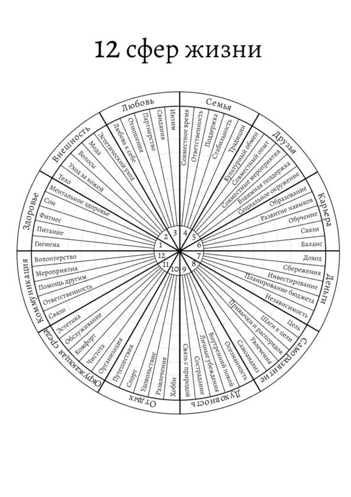

# Баланс
Социальная значимость баланса за последние годы увеличилась и будет расти. В наших Sprint-ах держать баланс является признаком не готовности к изменениям. В одной из статей я наткнулся на технику 70-х годов от Пол Майера, автора более 100 книг по саморазвитию. Техника - кольцо жизненного баланса, в котором находится от 8 до 12 и более сфер вашей жизни, заполнив каждую вы буквально в процессе поймете какие стороны у вас проседают.  Настоятельно рекомендую заполнить этот круг, чтобы определить ваши текущие приоритетные сферы или утвердится в них, но ни в коем случае не пытайтесь выравнять остальные. 

Кольцо жизненного баланса работает для тех, кто:
- боится идти на риск.
- ценит комфорт выше достижений.
- готов менять цель ради спокойствия.

Жизнь не обязана быть ровной. Периоды перекос в одну сторону - это нормально, если цель оправдывает жертву. Кольцо подразумевает, что все должны развиваться по одинаковым категориям. Но ваши приоритеты могут вообще выпадать из этой схемы - и это не значит что вы "живете неправильно". Заполнив кольцо вы вдруг увидите, что у вас только 3 из 10. Мозг начинает паниковать: "Я отстаю!". Хотя, может, вы туда и не собирались.

Философски я бы сказал так: баланс - это не цель, а побочный эффект, который иногда случается, когда вы движетесь по своему вектору. Если уж делать кольцо, то оно должно быть вашим, с вашими сегментами и кривыми пропорциями, а не шаблонным набором от коуча.

### Работа мозга
Классическое "колесо жизненного баланса" - это инструкция для тех, кто хочет прожить тихо и незаметно. Оно говорит: "Развивайся равномерно, не перекладывай все яйца в одну корзину". Но мы не собираем яйца. Мы охотимся. А охотник не может быть "в равновесии" с добычей - он должен быть быстрее, умнее, сильнее. 

### Использование в Sprint-е
В Sprint мы сознательно перегружаем одну сферу жизни, оставляя остальные на минимальном уровне, достаточном для выживания. Так создается рывок, который меняет ваш масштаб. Сопряженные сферы подтягиваются автоматически. Когда вы растете в самореализации, часто растет доход -> меняется окружение -> улучшается здоровье (есть деньги и мотивация) -> отношения приходят в комплекте. Некоторые сегменты останутся хромыми, но этого и не нужно исправлять, если они не мешают вашей траектории.

Я бы вывел такую формулу Баланса:  
Баланс = Побочный эффект самореализации * Время 
(а если побочный эффект не наступил - значит, он и не нужен).
