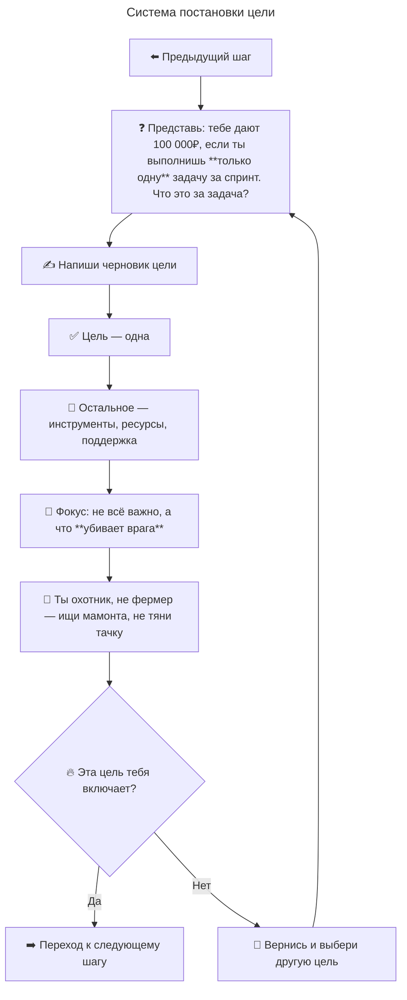

```mermaid
---
title: Система постановки цели
---
flowchart TB
	prev[⬅️ Предыдущий шаг]
	prev --> goal_test[❓ Представь: тебе дают 100 000₽, если ты выполнишь **только одну** задачу за спринт. Что это за задача?]


	goal_test --> goal_draft[✍️ Напиши черновик цели]
	goal_draft --> goal_param_1[✅ Цель — одна]
	goal_param_1 --> goal_param_2
	goal_param_2[🔧 Остальное — инструменты, ресурсы, поддержка] -->	goal_param_3[🥷 Фокус: не всё важно, а что **убивает врага**]
	goal_param_3 --> goal_param_4[🏹 Ты охотник, не фермер — ищи мамонта, не тяни тачку]
	goal_param_4 --> confirm_goal{🔥 Эта цель тебя включает?}

	confirm_goal -- Да --> next[➡️ Переход к следующему шагу]
	confirm_goal -- Нет --> retry[🔁 Вернись и выбери другую цель] --> goal_test
```