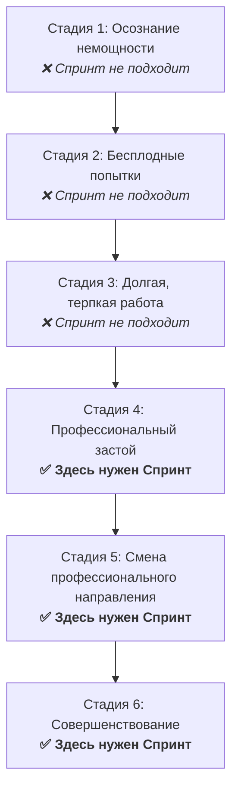

### Стадии развития и где нужен Спринт

Развитие — не равномерная линия вверх. Это лестница с провалами, откатами, выгоранием и неожиданными сдвигами. Кто-то называет это путём, кто-то — карьерной траекторией, но суть остаётся: есть стадии. Понимание того, на какой стадии ты находишься — ключ к выбору инструмента. Потому что один и тот же подход может быть спасением на одной ступени и пустой тратой времени — на другой.

**Стадия первая — Осознание немощности.** Это не про «я слабый». Это про момент, когда ты впервые видишь масштаб разрыва между собой и тем, кем хочешь быть. Ты смотришь на успешных, уверенных, состоявшихся — и чувствуешь внутри зияющую пустоту. «А я кто?» Этот этап болезненный, но честный. Ты впервые отказываешься от иллюзий. Понимаешь, что никто не придёт и не поднимет тебя. Но пока нет ни карты, ни силы, ни привычек.

**Стадия вторая — Бесплодные попытки.** Это метание. Курсы, мотивационные видео, короткие вспышки активности. Кажется, что ты начинаешь двигаться, но всё рассыпается. Неделя продуктивности — и снова откат. Ты злишься на себя, ищешь волшебную таблетку, не понимаешь, почему ничего не работает. Это этап проб. Ты просто не наработал ни одного рабочего механизма. А без системы ты всегда будешь падать назад.

**Стадия третья — Долгая, терпкая работа.** В этот момент ты уже понял: никто не спасёт. Ты просто встал и начал работать. Каждый день. Без вдохновения. Без эйфории. Ты вкладываешься, делаешь, терпишь. И это тяжёлое, нудное, постоянное движение начинает давать первые плоды. У тебя появляются навыки, проекты, репутация. Ты выходишь из болота, но ещё слишком занят тем, чтобы не утонуть снова.

**Стадия четвёртая — Профессиональный застой.** Самая тихая, коварная точка. Всё работает. Ты зарабатываешь. У тебя есть клиенты, задачи, результат. Но внутри пусто. Всё стало цикличным. Ты не растёшь. Ты просто повторяешь себя. Никакой боли, но и никакого настоящего удовольствия. Это ловушка, в которой сгорают многие. Здесь и начинается настоящая потребность в Спринте.

**Стадия пятая — Смена профессионального направления.** Не потому, что «всё плохо». А потому что ты больше не хочешь играть в старую игру. Навыки есть, мышление есть, но ты чувствуешь, что этот путь пройден. И тогда — скачок. Иногда резкий. Иногда — постепенный. Но это уже рост. Это не от нуля — это с базы, которую ты выстроил. Здесь тоже нужен Спринт. Потому что чтобы выйти из старого и пробить новый потолок, тебе нужно напряжение. Чёткое. Сжатое. Управляемое.

**Стадия шестая — Совершенствование.** Ты не просто что-то умеешь — ты в профессии. Ты на сцене. Ты влияешь. И всё, что ты делаешь, должно быть точным. Без распыления. Спринт здесь становится не столько рывком, сколько огранкой. Это уже не про спасение. Это про фокус. Про то, чтобы отрезать мусор и подняться ещё на один уровень.

Теперь — главное. Спринт НЕ подходит на первых трёх стадиях. Почему? Потому что на этих этапах ты не в ресурсе. У тебя нет ни дисциплины, ни базы, ни ясной цели. Ты в поиске. В хаосе. На этих стадиях нужно работать через боль, долго, нудно, системно. Никакой «резкий рывок» не поможет, если ты не знаешь, куда его направить. У тебя нет рычага. Всё, что ты можешь — это вложиться в создание фундамента.

Спринт работает только с тех, у кого уже есть база. Он усиливает. Помогает выйти из застоя. Заменить полумёртвую стабильность на риск и рост. Спринт нужен тем, кто стоит на границе нового уровня. И знает, что без усилия он не прыгнет.

